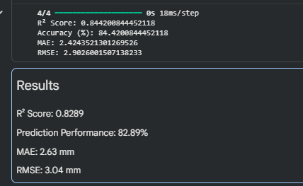

# 🌧️ Rainfall Prediction System

A machine learning project that predicts rainfall (in mm) from historical weather parameters using a feed-forward neural network built with TensorFlow/Keras — with a desktop GUI for real-time predictions.

---

## Problem Statement

Accurate rainfall prediction plays a crucial role in agriculture, water resource management, disaster preparedness, and environmental planning. Traditional forecasting methods often struggle to capture the complex, non-linear relationships between weather parameters. This project builds a neural-network-based regression model that estimates rainfall from historical weather conditions such as temperature, humidity, wind speed, pressure, and cloud cover.

---

## Objective

Predict rainfall (mm) using meteorological parameters — temperature, humidity, wind speed, pressure, cloud cover, month, and year — by training a feed-forward neural network on historical weather data.

---

## Dataset

The model is trained on `rainfall_dataset.csv`, containing 500 weather observations with the following columns:

| Column      | Description                          |
|-------------|--------------------------------------|
| Year        | Year of observation                  |
| Month       | Month of observation (1–12)          |
| Temperature | Temperature (°C)                     |
| Humidity    | Relative humidity (%)                |
| WindSpeed   | Wind speed                           |
| Pressure    | Atmospheric pressure                 |
| CloudCover  | Cloud cover (0–1)                    |
| Rainfall    | Rainfall in mm (target variable)     |

---

## Project Structure

```
Rainfall_Prediction_System/
├── Rainfall_Prediction_System.ipynb   # Main notebook: preprocessing, training, evaluation
├── rainfall_gui.py                    # Tkinter desktop GUI for real-time prediction
├── rainfall_dataset.csv               # Training dataset
├── requirements.txt                   # Python dependencies
├── LICENSE                            # MIT License
└── README.md                          # Project documentation
```

---

## Project Workflow

1. **Data Loading & Cleaning** — Load the CSV with Pandas and impute missing values using column means.
2. **Feature/Target Split** — Separate the seven input features (X) from the target variable, rainfall (y).
3. **Normalization** — Scale both features and target to [0, 1] using MinMaxScaler.
4. **Train/Test Split** — 80/20 split (random_state=42) for reproducibility.
5. **Model Training** — Train a feed-forward neural network for 60 epochs using the Adam optimizer and MSE loss.
6. **Evaluation** — Inverse-transform predictions back to the original scale and evaluate using R², MAE, and RMSE.

---

## Model Architecture

| Layer         | Units      | Activation |
|---------------|------------|------------|
| Input         | 7 features | —          |
| Hidden Layer 1| 32         | ReLU       |
| Hidden Layer 2| 16         | ReLU       |
| Output        | 1          | Linear     |

- **Optimizer:** Adam
- **Loss Function:** Mean Squared Error (MSE)
- **Epochs:** 60

---

## Results

| Metric               | Value    |
|----------------------|----------|
| R² Score             | 0.83     |
| Prediction Performance | ~82.9% |
| MAE                  | 2.63 mm  |
| RMSE                 | 3.04 mm  |

The model demonstrates strong predictive capability, successfully learning the relationship between weather parameters and rainfall levels.



---

## Desktop GUI

A Tkinter-based desktop application (`rainfall_gui.py`) allows users to interact with the trained model without touching any code.

**Features:**
- Upload any compatible CSV dataset
- Train the neural network with one click
- Live status updates during training
- Input weather parameters and get instant rainfall predictions
- Achieves ~80% R² accuracy on the included dataset

**How to run:**
```bash
pip install pandas numpy scikit-learn keras tensorflow
python rainfall_gui.py
```

### Screenshots

**Upload Dataset**


**Dataset Loaded**


**Training Model**


**Model Trained**


**Final Prediction**


---

## Tech Stack

- Python
- Pandas / NumPy
- Scikit-learn
- TensorFlow / Keras
- Tkinter
- Google Colab

---

## Getting Started

### Prerequisites
- Python 3.8+
- pip

### Installation

```bash
git clone https://github.com/rayyan4676t7/Rainfall_Prediction_System.git
cd Rainfall_Prediction_System
pip install -r requirements.txt
```

### Usage

**Notebook:** Open and run `Rainfall_Prediction_System.ipynb` in Jupyter Notebook, JupyterLab, or Google Colab. Make sure `rainfall_dataset.csv` is in the same directory.

You can also launch it directly in Colab:

[](https://colab.research.google.com/github/rayyan4676t7/Rainfall_Prediction_System/blob/main/Rainfall_Prediction_System.ipynb)

**Desktop GUI:** Run `python rainfall_gui.py` after installing dependencies.

---

## Applications

- Weather forecasting
- Agriculture planning
- Water resource management
- Disaster risk assessment
- Environmental monitoring

---

## Future Scope

- Compare performance with Random Forest and XGBoost models.
- Train on larger, real-world meteorological datasets.
- Deploy the model as a web application.
- Integrate real-time weather APIs for live prediction.
- Improve accuracy through systematic hyperparameter tuning.

---

## Conclusion

This project demonstrates a working neural-network-based rainfall prediction pipeline, achieving an R² score of approximately 0.83 on the held-out test set. It includes an end-to-end machine learning workflow — preprocessing, scaling, model design, training, and evaluation — as well as a desktop GUI for real-time interaction with the trained model.

---

## License

This project is licensed under the MIT License.

---

## Author

**Rayyan** — [@rayyan4676t7](https://github.com/rayyan4676t7)
